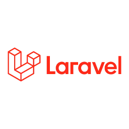
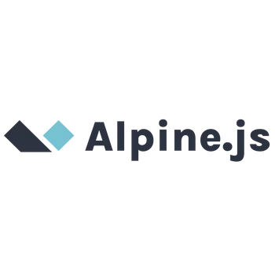

  <!-- Row Atas: 3 Gambar -->
  

    
    
    
  

  <!-- Row Bawah: 2 Gambar (Tengah) -->
  

    
    
  

---

#  PintarYuk! — 

**PintarYuk!** adalah sebuah platform toko buku digital modern yang dirancang untuk merevolusi cara pengguna berinteraksi dengan buku secara online. Project ini dikembangkan sebagai inti project dalam program **Praktek Kerja Lapangan (PKL) SMK Assalaam Bandung**.

Dibangun dengan standar industri, **PintarYuk!** mengedepankan pengalaman visual yang dinamis tanpa mengabaikan performa sistem yang solid di sisi backend.

---

###  Architecture & Core Technologies

Project ini menggunakan ekosistem teknologi modern yang memastikan skalabilitas dan efisiensi kode:

* **Backend:** Laravel Framework (PHP) — Menangani logika bisnis, keamanan data, dan manajemen database.
* **Frontend Engine:** JavaScript (ES6+) — Mengatur interaktivitas tingkat tinggi pada sisi klien.
* **Styling & UI:** Tailwind CSS — Memastikan desain yang konsisten, responsif, dan *user-friendly*.
* **Motion Magic:** GSAP (GreenSock Animation Platform) — Memberikan pengalaman *smooth-scrolling* dan transisi elemen yang elegan.
* **Design Concept:** **Atomic Design Method** — Penulisan komponen UI yang terstruktur mulai dari *Atoms* hingga *Pages*.

---

###  Key Deliverables

Platform ini menghadirkan fitur-fitur premium yang berfokus pada kenyamanan pengguna:

1. **Immersive Book Gallery:** Eksplorasi koleksi buku dengan tata letak yang bersih dan navigasi intuitif.
2. **Smart Notification System:** Update real-time mengenai rilis buku terbaru dan aktivitas akun.
3. **Dynamic Discount Engine:** Sistem manajemen promo dan diskon yang terintegrasi langsung pada katalog.
4. **Exclusive Event Hub:** Ruang khusus bagi pengguna untuk berpartisipasi dalam berbagai event literasi unik.
5. **User-Centric Experience:** Penerapan UI/UX yang telah dioptimasi untuk berbagai perangkat (Desktop & Mobile).

---

###  Design Excellence

Bukan sekadar website, **PintarYuk!** adalah implementasi nyata dari desain yang berpusat pada manusia (*Human-Centered Design*). Dengan penggunaan **Atomic Design**, setiap komponen UI dibuat secara modular sehingga sangat mudah untuk dikembangkan lebih lanjut (scalable) di masa depan.

---

###  Development Team

**PintarYuk! Project** — Dikembangkan dengan dedikasi oleh:

* **Kelompok 1 (isrofil)**
* **SMK Assalaam Bandung**
* *Competency: Software Engineering (RPL)*

**Role** - Pengembang

- Frontend : Davin Gahisan Mustafid
- Backend : Satria Maulana Asrul
- Database Analis : Haitsam Haidar
- Dokumen : Alifia awaliyah

---

> **PintarYuk!** — *Percayakan Bisnis anda Pada Kami.*

---
